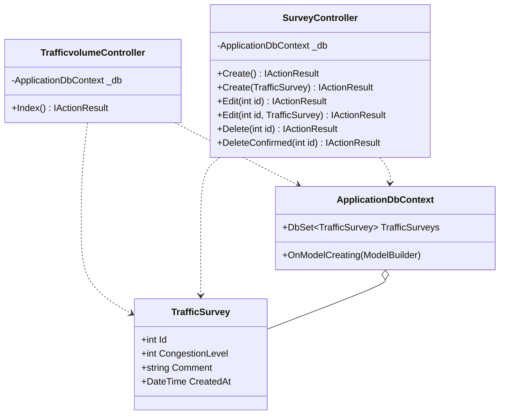
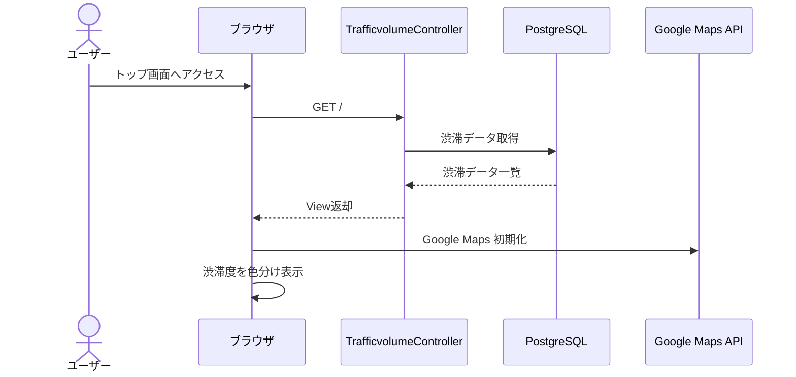
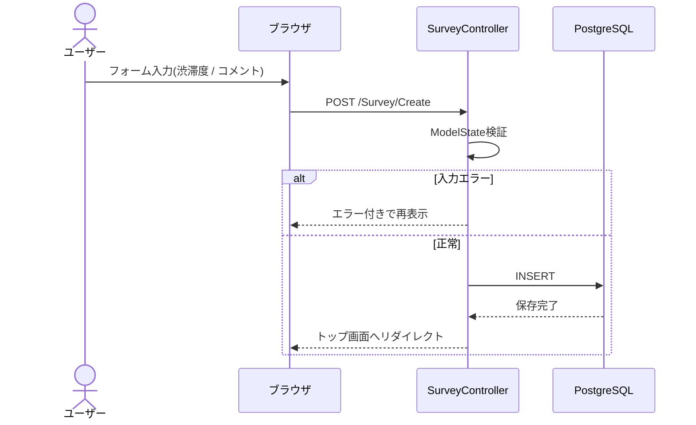
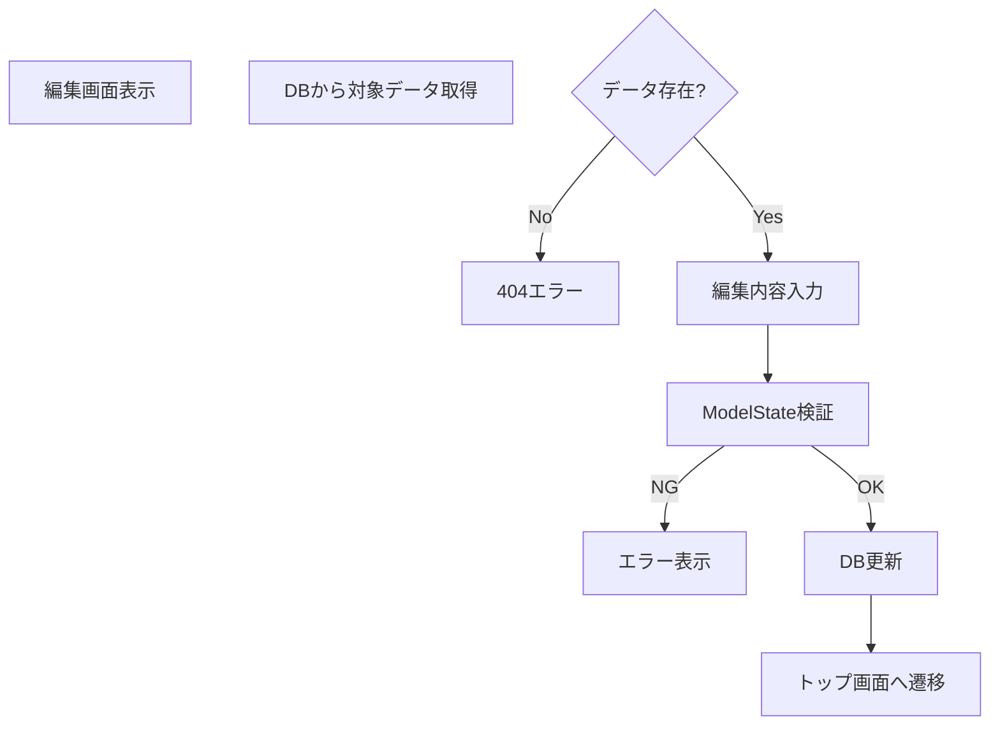
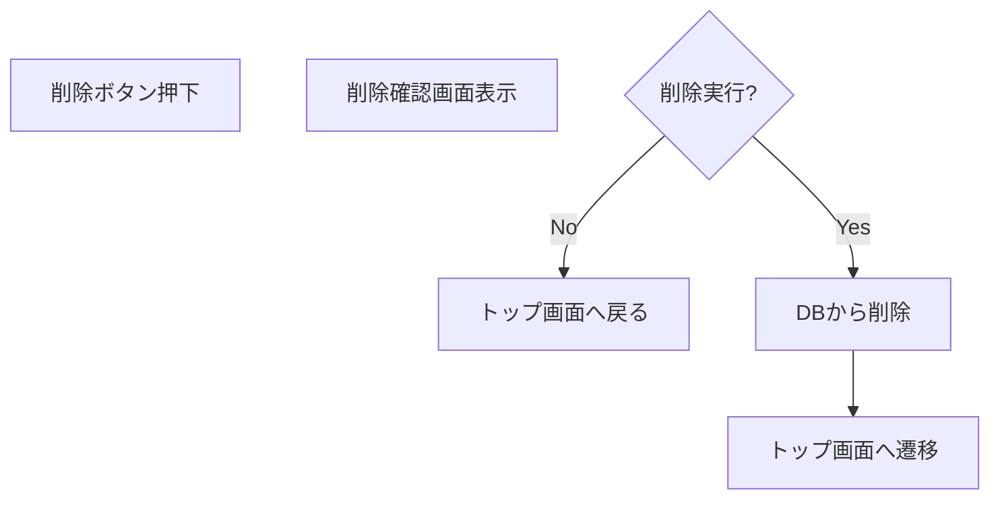
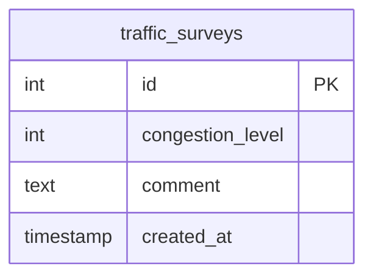

# 道路渋滞観測アプリ 内部設計書（ドラフト）

| 項目      | 内容                  |
| ------- | ------------------- |
| プロジェクト名 | Jyutai_Map（渋滞観測アプリ） |
| バージョン   | 0.1（ドラフト）           |
| 作成日     | 2026-05-21          |
| ステータス   | レビュー前               |

> 本書は要件定義書 `渋滞観測アプリ要件定義書.md` および外部設計書 `外部設計書.md` を踏まえ、内部実装の構造（クラス図 / 処理フロー / ER図 / テーブル定義）を整理した内部設計書のドラフトである。

---

# 1. クラス図

## 1.1 モデル / DbContext / コントローラ全体図

---

## 1.2 クラスの責務

| クラス                       | 種類        | 責務                 |
| ------------------------- | --------- | ------------------ |
| `TrafficSurvey`           | エンティティ    | 渋滞情報アンケートデータを保持する  |
| `ApplicationDbContext`    | DbContext | EF Core の DB 接続管理  |
| `TrafficvolumeController` | コントローラ    | 地図表示と渋滞度表示         |
| `SurveyController`        | コントローラ    | アンケートの投稿 / 編集 / 削除 |

---

# 2. 処理フロー

## 2.1 地図表示（F-01）

---

## 2.2 アンケート投稿（F-02）

---

## 2.3 アンケート編集（F-03）

---

## 2.4 アンケート削除（F-04）

---

# 3. テーブル定義書

## 3.1 ER図

---

## 3.2 テーブル定義

### 3.2.1 `traffic_surveys`

| カラム              | 型         | NULL     | デフォルト    | 説明       |
| ---------------- | --------- | -------- | -------- | -------- |
| id               | integer   | NOT NULL | identity | 主キー      |
| congestion_level | integer   | NOT NULL | -        | 渋滞度（1〜5） |
| comment          | text      | NULL     | -        | コメント     |
| created_at       | timestamp | NOT NULL | now()    | 投稿日時     |

---

## 3.3 制約

| 種類      | 内容                               |
| ------- | -------------------------------- |
| 主キー     | id                               |
| CHECK制約 | congestion_level BETWEEN 1 AND 5 |

---

# 4. バリデーション設計

| 項目   | 条件      | エラーメッセージ              |
| ---- | ------- | --------------------- |
| 渋滞度  | 必須      | 渋滞度を選択してください          |
| 渋滞度  | 1〜5     | 1〜5の範囲で入力してください       |
| コメント | 200文字以内 | コメントは200文字以内で入力してください |

---

# 5. API / 外部サービス利用

| サービス                  | 用途     |
| --------------------- | ------ |
| Google Maps API       | 地図表示   |
| Entity Framework Core | DB操作   |
| PostgreSQL            | データ保存  |
| Bootstrap 5           | UIデザイン |

---

# 6. 改訂履歴

| 改定日        | バージョン | 改訂者 | 改定箇所 | 改定内容                              |
| ---------- | ----- | --- | ---- | --------------------------------- |
| 2026-05-21 | 0.1   | 担当者 | –    | 初版作成（クラス図 / 処理フロー / ER図 / テーブル定義） |
