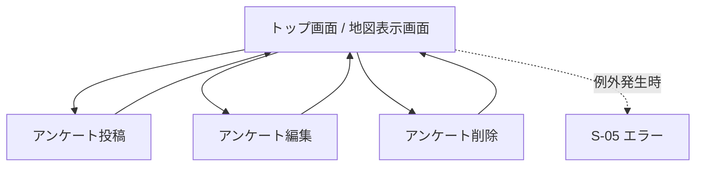

# 道路渋滞観測アプリ 外部設計書（ドラフト）

| 項目 | 内容 |
|---|---|
| プロジェクト名 | Jyutai_Map（フィールドワーク共有アプリ） |
| バージョン | 0.1（ドラフト） |
| 作成日 | 2026-05-21 |
| ステータス | レビュー前 |

> 本書は要件定義書 [`渋滞観測アプリ要件定義書.md`](../requirements/要件定義書.md) を踏まえ、現状の実装に基づいて外部から見える画面・機能・遷移を整理した外部設計書のドラフトです。
> 詳細なワイヤーフレームは Figma で別途作成予定のため、本書では構成要素レベルの記述に留めます。

---

## 1. 画面一覧

### 1.1 画面（GET でビューを返すもの）

| ID | 画面名 | URL | コントローラ.アクション | 認証 | 概要 |
|---|---|---|---|---|---|
| S-01 | 場所一覧（地図） | `/` | `Trafficvolume.Index` | 追加予定 | アプリのトップページにすぐ地図を表示させる |
| S-02 | アンケート投稿 | `/` | `SurveyController.Create` (GET) | 追加予定 | アンケートの投稿(五段階評価とコメントの記述) |
| S-03 | アンケート編集 | `/` | `SurveyController.Edit` (GET) | 追加予定 | アンケートの評価とコメントの編集 |
| S-04 | アンケート削除 | `/` | `SurveyController.delete` (GET) | 追加予定 | アンケートの削除 |
| S-05 | エラー | `/` | 未定 | 要 | 例外発生時のエラー画面 |
### 1.2 画面を持たない POST アクション

| アクション | URL | トリガー | 概要 |
|---|---|---|---|
| アンケート投稿削除 |  | S-04 地図表示画面下の削除ボタン | 確認ダイアログ後に削除 |

---

## 2. 画面遷移図

> 認証を要する画面（S-05〜S-08）に未ログインでアクセスした場合は、ASP.NET Core Identity の標準動作によりログイン画面（S-04）にリダイレクトされる。

---

## 3. 各画面ワイヤーフレーム概要

> 本節は構成要素の概要のみを記載する。レイアウト詳細・配色・余白等は Figma で確定する。

### S-01 場所一覧（地図）
- APIを使用した地図の表示と渋滞度の表示
- 投稿されたアンケートの表示
- アンケートの投稿、編集、削除ボタン

### S-02 アンケート投稿
- 渋滞度の五段階で評価を選べられるボタン式
- コメント記述欄
- 投稿ボタン

### S-03 アンケート編集
- アンケートのコメント編集欄
- 変更ボタン

### S-04 アンケート削除
- アンケートの削除確認ボタン

### S-05 エラー
- エラーメッセージの表示
- トップ画面(地図)の移動ボタン

---

## 4. 機能一覧

### 4.1 機能要件

| ID | 機能名 | 関連画面 | 概要 | 認証 | 権限 |
|---|---|---|---|---|---|
| F-04 | 地図表示 | S-01 | Google Maps API を使用した地図の表示 / 地図内に渋滞度を色に分けて表示させる | 不要 | 全グループ閲覧可 |
| F-07 | アンケート投稿 | S-02 | 渋滞度に対する五段階評価とコメントの記入 / 投稿 | 不要 | 全グループ閲覧可 |
| F-08 | アンケート編集 | S-03 | 投稿されたアンケートのコメントの編集 / 上書き保存 | 不要 | 全グループ閲覧可 |
| F-09 | アンケート削除 | S-04 | 投稿されたアンケートの削除 | 不要 | 全グループ閲覧可 |

### 4.3 権限ルール

| 操作 | 権限 |
|---|---|
| バージョン0.1では権限はなし | バージョン0.1では権限はなし |

---

## 改訂履歴

| 改定日 | バージョン | 改訂者 | 改定箇所 | 改定内容 |
|---|---|---|---|---|
| 2026-05-21 | 0.1 | 担当者 | – | 初版作成（画面一覧 / 画面遷移図 / ワイヤーフレーム概要 / 機能一覧） |
